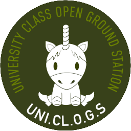

# UniClOGS

***

This is an umbrella repo, containing all of the various components, firmware, and software, and their respective separate repos.

Each repository is just a submodule. Checkout our [Read The Docs](https://uniclogs-software.readthedocs.io) page if you'd like a quick overview of the system as a whole. Or click on a git-submodule to follow it to its repo and it's own separate documentation, if you'd like to learn more about that particular submodule.

***

## Cloning this repo
- `git clone --recursive https://github.com/oresat/uniclogs-software`

## Project Documentation

This project uses Sphinx for documentation generation.

### Installation:
`$` `pip install -r docs/source/requirements.txt`

### Generate Docs:
`$` `cd docs`

`$` `make clean html`

***

### OreFLAT0

A development version of OreSAT0 is integrated into the SatNOGS network by the name `OREFLAT-0`.

Several [provisional TLE's](./tles) have been provided to mock the satellite within the SatNOGS environment and provide necessary parameters for testing with Satnogs-in-the-loop.

***

## Miscellaneous Services

#### Mock Oresat

A mock of OreSat has been provided to stand in place of the actual satellite when integrating COSMOS tools into development.

**Start Mock-OreSat:**

`$` `python3 ./cosmos/mocks/oresat.py`

#### COSMOS Install

A docker image has been provided to make the development experience more seamless while allowing COSMOS to operate in the environment it needs. This docker image is based off the official [BallAerospace COSMOS Image](https://hub.docker.com/r/ballaerospace/cosmos) but has been modified to include configurations and settings needed for UniClOGS.

**Install and run `ms-cosmos` from DockerHub:**

`$` `docker pull dmitrimcguuckin/ms-cosmos`

`$` `docker run --tty --interactive --detach --name cosmos --network=host --ipc=host --env DART_DB=$DART_DB --env DART_USERNAME=$COSI_USERNAME --env DART_PASSWORD=$COSI_PASSWORD --env DISPLAY=$DISPLAY --volume $XAUTH:/root/.Xauthority --volume /var/run/postgresql/.s.PGSQL.5432:/var/run/postgresql/.s.PGSQL.5432 dmitrimcguuckin/ms-cosmos`

`$` `docker attach cosmos`

**Note:** *The variables beginning with DART are expected to exist by COSMOS, and can be provided either manually or they can be exported as environment variables in a `.bashrc` file. Either way, they are required in order to forward the details to the container and to COSMOS.*

#### PostgreSQL

Visit the [official PostgreSQL website](https://www.postgresql.org/download/) for instructions on how best to install on your system.

***

## Useful Links

* [`ballcosmos` Infinite Wait Fix](https://github.com/BallAerospace/python-ballcosmos/commit/377552e91ffafea76acedee8cb7ada1abc202898)
* [`ballcosmos` Commands Demonstration](https://github.com/BallAerospace/python-ballcosmos/blob/master/examples/test_json_drb.py)
