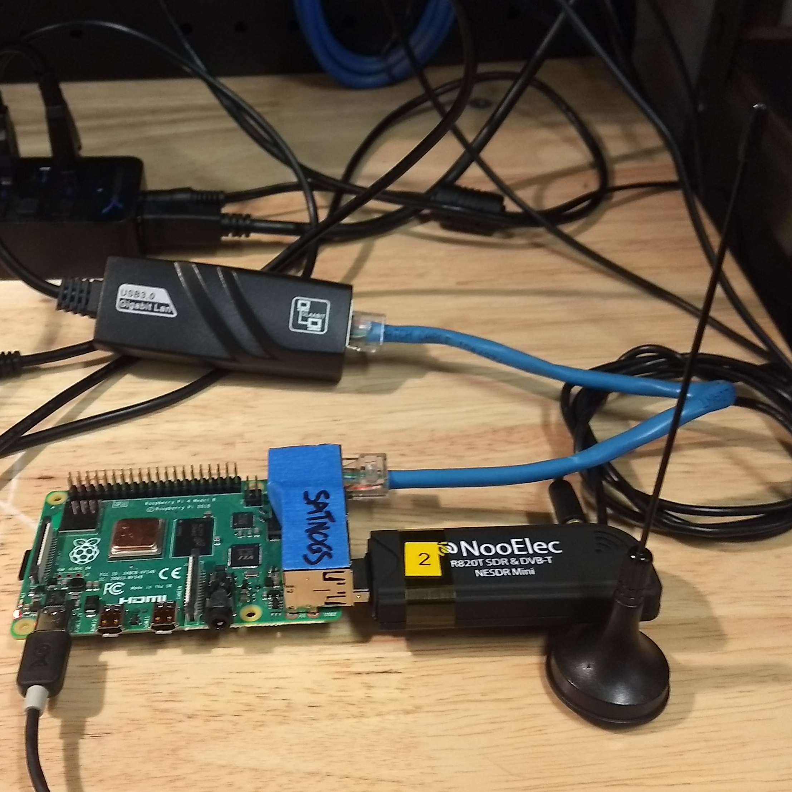

FlatNOGS
========

Introduction
------------

FlatNOGS is a mock-ground-station that is intended to simulate a generic SatNOGS ground-station capable of observing telemetry beacons from OreSat.

Taken from the `UniClOGS Hardware Repository <https://github.com/oresat/uniclogs-hardware/#rf-links>`_.

    "The ground station infrastructure provides two communications functions between the ground and the spacecraft, (1) downlink communications on UHF for the Telemetry Beacons and Command Responses from the spacecraft, (2) uplink communications on L-Band for the Commands to the spacecraft, and (3) downlink communications on S-band for mission payload and camera data."

FlatNOGS is primarily concerned with testing and demonstrating the functionality of link #1: downlink communications on the UHF band for the purposes of telemetry.

More specifically, we want to be able to capture telemetry from any ground-station in the SatNOGS network, where it will be demodulated and decoded, which will then be automatically uploaded to the SatNOGS Database, where we (the OreSat team) can re-obtain our telemetry via the SatNOGS DB API.

References and Guides Used
--------------------------

For the purposes of continuity and closest-simulation of a ground-station, this setup follows the guides provided by SatNOGS very closely with little deviation. A few extra tools have also been installed in order to aide in live-testing.

**See:**

1. `SatNOGS's Raspberry Pi Setup <https://wiki.satnogs.org/Raspberry_Pi>`_
2. `SatNOGS's Client Setup <https://wiki.satnogs.org/SatNOGS_Client_Setup>`_
3. `The rtl-sdr package wiki <https://osmocom.org/projects/rtl-sdr/wiki>`_
4. `GQRX Website <https://gqrx.dk/>`_

.. note::
  The `rtl-sdr` package is unofficial and not maintained by the owners of RTL-SDR.

Hardware
--------

1. Raspberry Pi Model 4B rev1.1
2. RTL-SDR R820T SDR
3. USB3.0 Gigabit LAN Adapter

**A word about the 2020-2021 FlatSat Network Infrastructure:**

Due to the 2019-2021 pandemic and following restricted access to our labs in the Engineering Building, the FlatSat bench is physically separated from the UniClOGS server.

FlatSat is located in the Portland State Business Accelerator (PSBA) building, whereas the UniClOGS server is located in the Engineering Building (EB) on the PSU campus.

To enable easy access both physically and digitally to the FlatSat bench, a sub-network of devices has been created by bridging all devices in the PSBA lab to the MDC via USB (LAN over USB) of which the MDC is then bridged to the UniClOGS server in the EB lab.

**A word about Raspberry Pi 4B and OTG:**

The Raspberry Pi 4 has had `documented issues <https://hackaday.com/2019/07/16/exploring-the-raspberry-pi-4-usb-c-issue-in-depth/>`_ with its On-The-Go (OTG) capabilities which is related to their choice of implementation of the USB-C port. The fix involves the installation of several drivers, some unofficial, as well as the rather complicated process of `manually enabling hardware overlays and additional kernel modules <https://encom.eu.org/posts/otg-ethernet-raspi/>`_.

Since a network connection over USB is required of FlatNOGS, (due to aforementioned network-requirements), this setup opts for the simpler solution: an Ethernet-to-USB adapter.

Operating System
----------------

1. Raspbian Buster 10 (arm71)

For purposes of continuity, the custom edition of Raspbian provided by SatNOGS is used, (`Release 2020122700 <https://gitlab.com/librespacefoundation/satnogs/satnogs-pi-gen/-/jobs/artifacts/2020122700/download?job=release>`_).

Software
--------

**On FlatNOGS:**

1. `satnogs-setup`: SatNOGS's client and general configuration manager
2. `satnogs-client`: SatNOGS's daemon for scheduling and processing satellite observations.
3. `gr-satnogs`: SatNOGS's fork of `gr_satellites` which provides tools for analyzing RF IQ waterfalls
4. `rtl-sdr`: An unofficial package for binding raw RTL-SDR waterfall data to a TCP socket

**Off FlatNOGS:**

1. `gqrx`: A general-purpose SDR-receiver powered by GNU Radio.

Example Config
--------------

This is an example config taken from this `SatNOGS Observation`_. The section of importance is the `"radio"`` dictionary, wherein all of the important radio parameters specifically for observing OreFlat from FlatNOGS are defined.

Any applicable parameters should be matched across tools, *(such as gqrx)*, for the purposes of continuity.

.. literalinclude:: gs-config.json
  :language: JSON

.. _SatNOGS Observation: https://network-dev.satnogs.org/observations/31527
