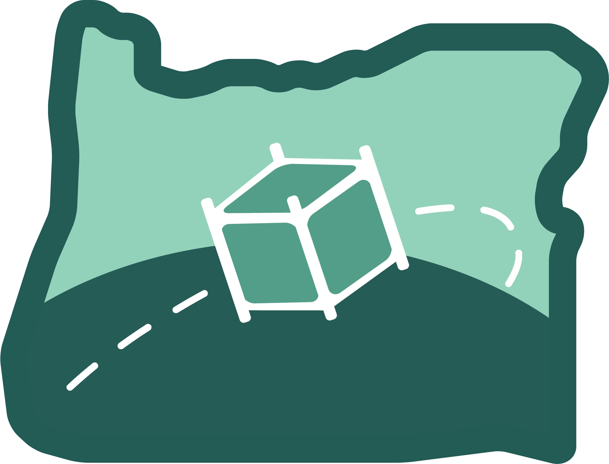

Welcome to UniClOGS Software's documentation!
=============================================

.. image:: ../images/gs-patch.png

Documentation for UniClOGS, as well as a brief overview of the system as a whole and how the groundstation services OreSat.

.. warning::
    This is still a work in progress.

Glossary
--------

.. toctree::
    :maxdepth: 1

    glossary

What is UniClOGS?
-----------------

UniClOGS is an open-source and open-hardware ground station designed and used by the Portland State Aerospace Society.

The physical antenna is located on the roof of the Engineering Building on the PSU campus.

.. image:: ../images/uniclogs.png

What is OreSat?
---------------

OreSat is a open source CubeSat from Oregon by PSAS (Portland State Aerospace
Society).

What is FlatNOGS?
-----------------

.. toctree::
    :maxdepth: 1

    flatnogs

What is OreFlat?
----------------

.. toctree::
    :maxdepth: 1

    oreflat

Software Components
-------------------

.. toctree::
    :maxdepth: 1

    software/index

Indices and Tables
------------------

* :ref:`genindex`
* :ref:`modindex`
* :ref:`search`

.. _OreSat Website: https://www.oresat.org/
.. _OreSat GitHub: https://github.com/oresat
