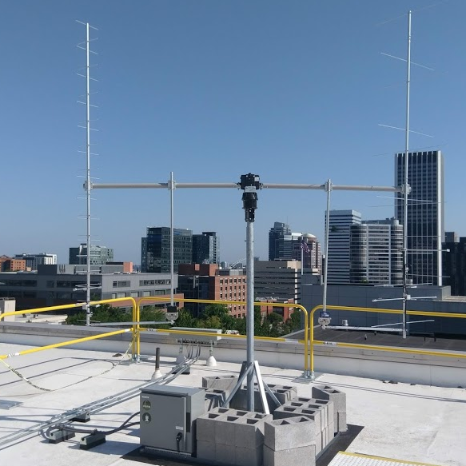

Welcome to UniClOGS Software's documentation!
=============================================

.. image:: ../images/gs-patch.png

Documentation for UniClOGS, as well as a brief overview of the system as a whole and how the groundstation services OreSat.

.. warning::
    This is still a work in progress.

What is UniClOGS?
-----------------

UniClOGS is an open-source and open-hardware ground station designed and used by the Portland State Aerospace Society.

The physical antenna os located on the roof of the Engineering Building on the PSU campus.

What is OreSat?
---------------

OreSat is a open source CubeSat from Oregon by PSAS (Portland State Aerospace
Society).

.. note:: If you are looking for more info on OreSat, go checkout `OreSat Website`_ and `OreSat GitHub`_

Glossary
--------

.. toctree::
    :maxdepth: 2

    glossary

UniClOGS Software Standards
---------------------------

.. toctree::
    :maxdepth: 2

    standards

UniClOGS Software Git Repos
---------------------------

.. toctree::
    :maxdepth: 2

    repos

Indices and Tables
==================

* :ref:`genindex`
* :ref:`modindex`
* :ref:`search`

.. _OreSat Website: https://www.oresat.org/
.. _OreSat GitHub: https://github.com/oresat
